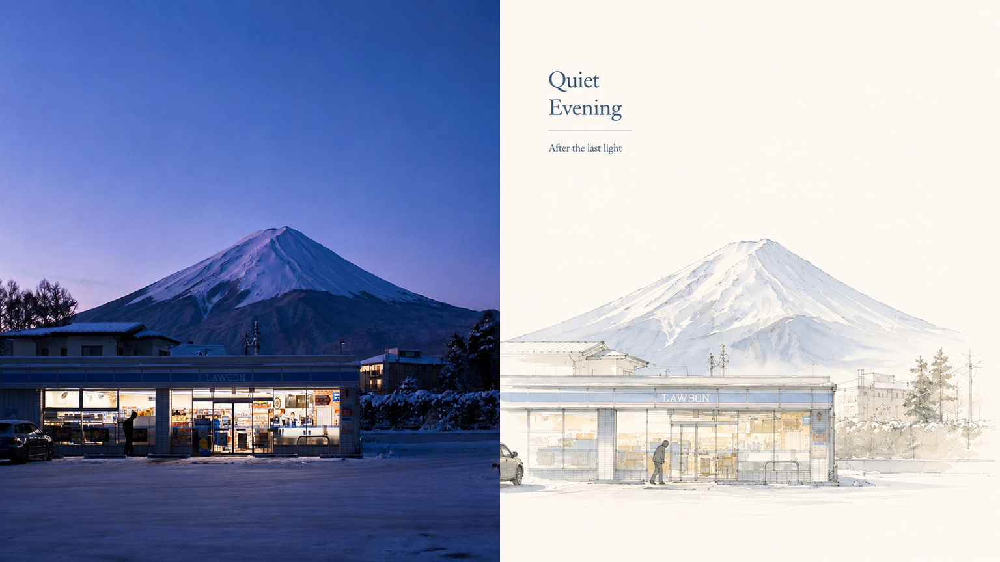
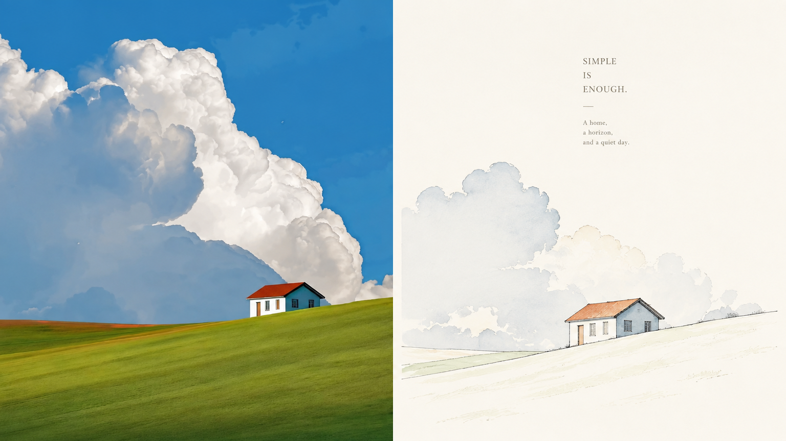
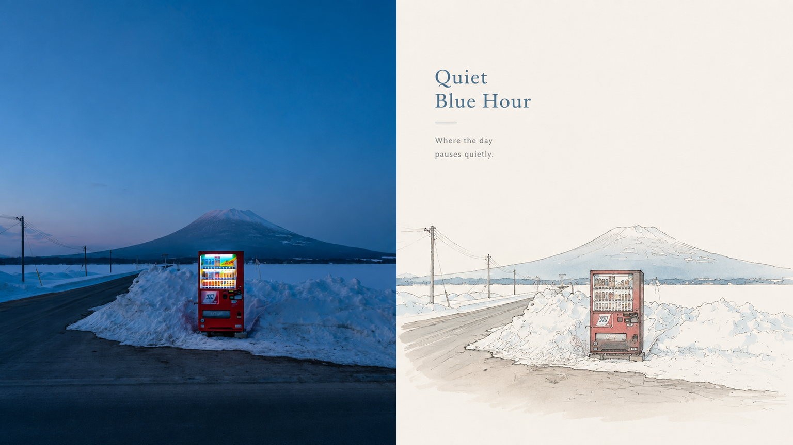
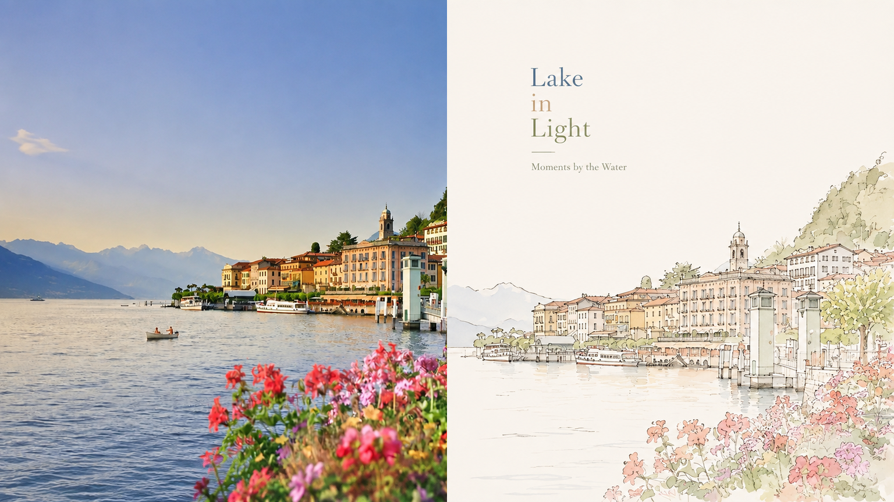
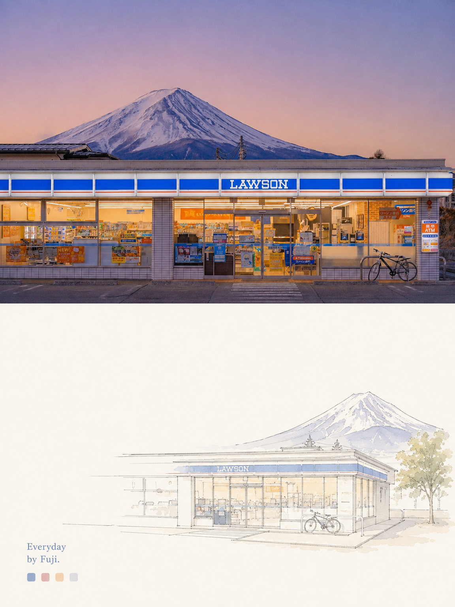
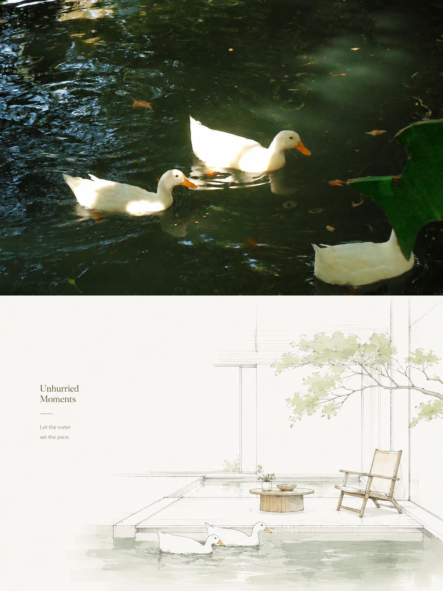
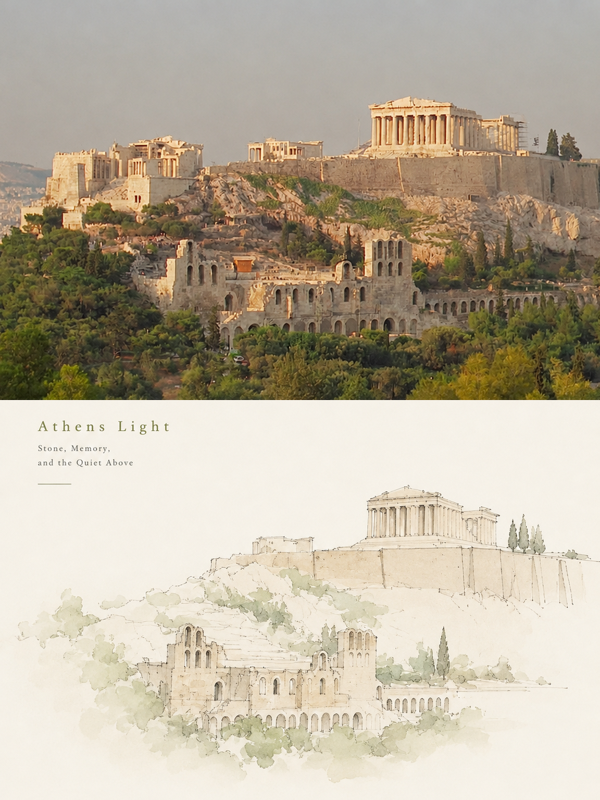

<div align="center">

# XXD Panel 155｜1점 투시 담채

일상 사진을 독립적인 아트 포스터로 재연출합니다. 알아볼 수 있는 핵심은 남기고 재료·구도·여백을 다시 설계합니다.

<a href="README.md">简体中文</a> · <a href="README.en.md">English</a> · <a href="README.ja.md">日本語</a> · <a href="README.ko.md">한국어</a> · <a href="README.ar.md">العربية</a>

</div>

## 샘플 작품

아래 샘플은 서로 다른 원본 참고 이미지를 사용했습니다. Panel 155이 각 이미지를 독립적으로 한 번만 생성했으며 AI 메타데이터도 제거했습니다. 가로 샘플은 왼쪽 원본·오른쪽 디자인의 정확한 50:50, 세로 샘플은 위 원본·아래 디자인의 정확한 50:50입니다.

예시의 한계: 여러 결과가 피사체가 큰 건축 외관 담채에 치우쳐 1점 투시 실내 재구성과 작은 중심 요건을 완전히 충족하지 못합니다. 연산 절약을 위해 단일 생성 결과를 보존했으며 완전 준수 기준작은 아닙니다. 실행 시 엄격하게 검수합니다.

**16:9 가로 · 좌우 50:50**

| sample-05 | sample-06 |
|---|---|
|  |  |
|  |  |

**3:4 세로 · 상하 50:50**

| sample-09 | sample-10 |
|---|---|
|  |  |
|  |  |

샘플은 각 원본 사진에 맞춘 짧고 영리한 영어 문구를 사용합니다.

## 잘 맞는 상황과 해결하는 문제

개인 사진 정리, 독립 출판, 전시 습작과 라이프스타일 비주얼에 적합합니다. 평범한 구도, 복잡한 배경, 작은 피사체도 덜어내기·재배열·크롭·크기 변화로 새로운 초점을 만들 수 있습니다. 단순한 사진 필터가 아닙니다.

하반부는 사진에서 가장 알아보기 쉬운 **대상, 윤곽, 구조, 자세와 서사적 관계**만 추출해 **1점 투시 실내 디자인 손그림 투시도 / 건축 실내 담채 표현도**로 재구성합니다. 사진 전체를 복제하거나 모든 사물을 남기지 않습니다. 불필요한 세부를 없애고 원물을 가장 잘 대표하는 구조, 방향의 흐름, 시각적 기억점만 남겨 다시 요약하며 위 사진과의 대응이 한눈에 드러나게 합니다.

## 원본 프롬프트 · 5개 언어

[简体中文](references/original-prompt/zh-CN.md) · [English](references/original-prompt/en.md) · [日本語](references/original-prompt/ja.md) · [한국어](references/original-prompt/ko.md) · [العربية](references/original-prompt/ar.md)

중국어 파일은 사용자의 원문을 글자 그대로 보존하며 실행 시 창작과 미적 판단의 유일한 기준입니다. 다른 네 언어는 완전하고 충실한 열람용 번역이며 생성 지시를 다시 쓰지 않습니다.

## 빠른 적합성 확인

원본의 정체성은 유지하면서 구도를 재연출하고, 재료의 특징과 의도적인 여백을 함께 살립니다. 정확한 문구·자동 문구·무문자, 단일 이미지·재귀 폴더 처리 및 아래 네 가지 출력 모드를 지원합니다.

## 사진을 결과물로 바꾸는 흐름

피사체와 관계 파악 → 원문의 시각 언어로 추출 → 무관한 세부 제거 → 크기·위치·여백 재구성 → 원본에 맞는 짧은 문구 → 비율·문자·완성도 확인

## 완성작의 식별 특징

**1점 투시, 건축 선화, 담채 렌더링, 새로 연출한 구도, 매우 넓고 의도적인 여백, 편집식 타이포그래피**를 결합한 고급 시각 효과를 완성합니다. 사물별 옮겨 그리기, 지나친 배경 보존, 꽉 찬 화면, 복잡한 사실주의, 무거운 수채, 만화 느낌, 3D 느낌과 틀에 박힌 효과를 피합니다.

## 네 가지 출력 모드

- `top-bottom`: 전폭 상하 두 영역만 사용합니다. 실제 사진은 위, 디자인은 아래에 정확히 50%씩 둡니다.
- `left-right`: 전고 좌우 두 영역만 사용합니다. 실제 사진은 왼쪽, 디자인은 오른쪽에 정확히 50%씩 두며 상하 구도로 돌리지 않습니다.
- `design-only`: 전체 캔버스에 Panel 155의 디자인 번역만 표시하고 사진은 보이지 않는 참고 자료로 사용합니다.
- `wallpaper-pack`: 휴대폰, iPad, 데스크톱, 시계용 완성 이미지를 각각 만들며 `linked` 또는 `independent`를 선택합니다.

모드와 크기는 여러 개 선택할 수 있습니다. `1:1`, `3:4`, `4:3`, `4:5`, `5:4`, `2:3`, `3:2`, `9:16`, `16:9`, `21:9`, `5:7`, `7:5`, 정확한 픽셀을 지원합니다. 텍스트는 모델 생성, 사용자 원문, 없음 중에서 선택합니다. 폴더 입력은 각 소스를 분리 처리하고 최종 PNG를 하나의 새 작업 폴더에 평면으로 저장합니다.

## 시작하기

```bash
git clone https://github.com/nevertoday/xxd-panel-155.git
npx skills add https://github.com/nevertoday/xxd-panel-155 --skill xxd-panel-155
```

설치 후 Agent 세션을 다시 시작하고 `$xxd-panel-155`을 호출하세요. 사용자 단위 Codex 설치에는 `--global --agent codex --yes`를 추가할 수 있습니다.

```text
/xxd-panel-155 photo.jpg --mode top-bottom --size 3:4 --text prompt --locale ko-KR
/xxd-panel-155 photo.jpg --mode left-right --size 16:9 --text prompt --locale en-US
/xxd-panel-155 photo.jpg --mode design-only --size 9:16 --text none
```

전체 실행 계약은 [SKILL.md](SKILL.md), 런타임 어댑터는 [영어](references/xxd-panel-155-prompt.en.md)와 [중국어](references/xxd-panel-155-prompt.zh-CN.md)를 확인하세요.

## 라이선스

이 프로젝트(Skill, 프롬프트, 스크립트, 문서, 함께 제공되는 샘플 이미지 포함)는 **PolyForm Noncommercial License 1.0.0**을 따릅니다. 전체 법률 문구는 [LICENSE](LICENSE), 공식 페이지는 <https://polyformproject.org/licenses/noncommercial/1.0.0>에서 확인하세요.

쉽게 말하면 다음과 같습니다.

- 개인은 학습, 연구, 실험, 테스트, 취미 프로젝트, 사적 오락에 사용할 수 있습니다. 자선 단체, 교육 기관, 공공 연구·안전·보건 기관, 환경보호 단체, 정부 기관도 사용할 수 있습니다.
- **비상업적 목적**이라면 사용, 복사, 수정, 파생 작업 제작, 공유가 가능합니다. 공유할 때는 이 라이선스(또는 위 링크)와 저자가 제공한 모든 `Required Notice:` 문구를 함께 제공해야 합니다.
- 상업 제품이나 서비스, 유료 납품, 접근권 또는 라이선스 판매, 상업적 적용으로 이어질 것으로 예상되는 용도에는 사용할 수 없습니다. 상업적으로 사용하려면 저작권자에게 별도의 서면 허가를 받아야 합니다.
- 이 계약은 명시된 저작권 라이선스와 제한된 특허 라이선스만 부여합니다. 상표, 브랜드명 또는 명시되지 않은 다른 권리를 부여하지 않으며 라이선스를 제3자에게 재허여할 수도 없습니다.
- 서면으로 위반 통지를 받으면 32일 안에 준수 상태로 돌아가고 실질적인 시정 조치를 해야 하며, 그렇지 않으면 라이선스가 즉시 종료됩니다. 특허 침해를 서면으로 주장해도 특허 라이선스가 종료됩니다.
- 콘텐츠는 법이 허용하는 범위에서 어떠한 보증도 없이 “있는 그대로” 제공됩니다. 사용에 따른 위험과 잠재적 손실은 사용자가 부담합니다.
